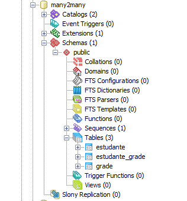

# SpringJpaMany2Many

Este exemplo mostra como fazer um relacionamento Many2Many no banco de dados com Spring JPA, Spring Boot & PostgreSQL.

### Pré-requisitos

Para executar a instalação, desenvolvimento e testes deverá ter instalado as seguintes tecnologias abaixo:

* [Java](https://www.oracle.com/technetwork/java/javase/downloads/jre8-downloads-2133155.html) - Plataforma Java
* [Maven](https://maven.apache.org/) - Ferramenta de automação
* [Spring Boot](http://spring.io/projects/spring-boot/) - Ferramenta facilita a criação de projetos
* [Spring Tool Suite](https://spring.io/tools) - IDE de desenvolvimento
* [PostgreSQL](https://www.postgresql.org/docs/) - Banco de dados relacional

### Testes

> Estrutura das tabelas.

## Author

* **Lucas A de Miranda Correia** - *Initial work* - [LAMC](https://github.com/lucasagnaldo)
